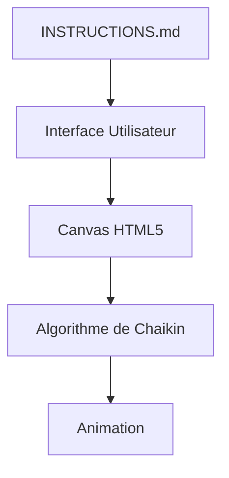
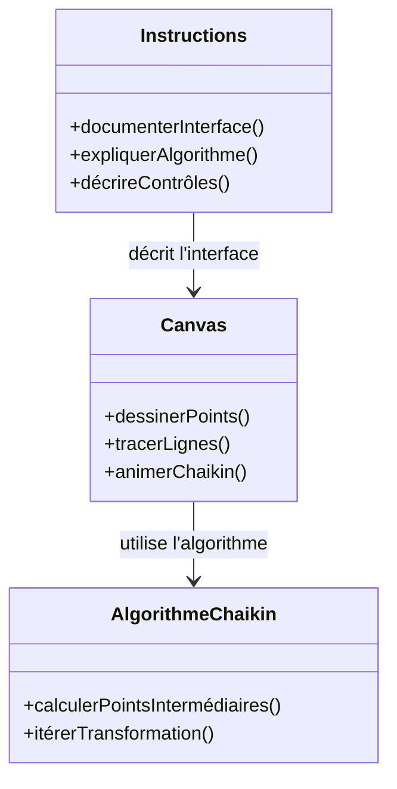
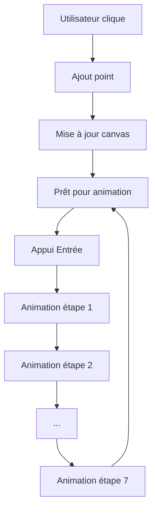
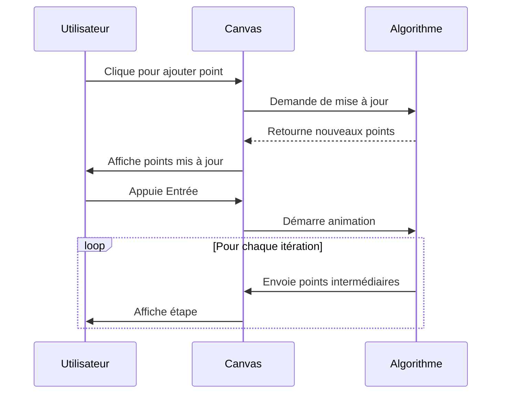

# Documentation Technique Complète du Fichier INSTRUCTIONS.md

## 1. Vue d'ensemble approfondie

### Rôle et objectif du fichier
Le fichier `INSTRUCTIONS.md` sert de guide utilisateur principal pour une application implémentant l'algorithme de Chaikin avec une animation canvas interactive. Il décrit de manière détaillée comment utiliser l'application, ses fonctionnalités et les interactions possibles.

### Responsabilités détaillées
Ce fichier a pour responsabilité principale :
1. Documenter l'interface utilisateur et les interactions
2. Expliquer le fonctionnement de l'algorithme de Chaikin
3. Décrire les contrôles clavier et souris
4. Présenter les fonctionnalités optionnelles
5. Fournir des instructions de base pour le débogage

### Dépendances et imports
Le fichier ne contient pas de dépendances techniques directes, mais il fait référence à :
- Un environnement graphique (canvas HTML5)
- Des événements souris et clavier
- Une implémentation de l'algorithme de Chaikin

### Contexte architectural
Ce fichier s'inscrit dans une architecture client-side simple :


### Historique et évolution
Le fichier a probablement évolué avec :
1. Une première version basique des instructions
2. L'ajout des fonctionnalités optionnelles
3. La clarification des interactions utilisateur
4. L'amélioration de la documentation des cas d'erreur

## 2. Analyse technique exhaustive

### Structure du fichier
Le fichier est organisé en sections logiques :
1. Introduction à l'application
2. Instructions d'utilisation
3. Fonctionnalités détaillées
4. Contrôles clavier
5. Fonctionnalités optionnelles
6. Comportements spécifiques

### Fonctionnalités clés
1. **Dessin des points de contrôle** :
   - Utilisation de la souris pour placer des points
   - Visualisation des points existants

2. **Animation de l'algorithme** :
   - Déclenchement par la touche Entrée
   - Animation étape par étape jusqu'à la 7ème itération
   - Reprise automatique après la 7ème itération

3. **Gestion des cas particuliers** :
   - Un point : affichage du point
   - Deux points : tracé d'une ligne droite
   - Aucun point : animation désactivée

### Algorithme de Chaikin
L'implémentation suit les principes de :
1. Subdivision des segments
2. Calcul des nouveaux points intermédiaires
3. Itération jusqu'à la précision souhaitée
4. Visualisation progressive des résultats

### Performance et complexité
- Complexité temporelle : O(n) par itération (n = nombre de points)
- Complexité spatiale : O(m) (m = nombre total de points après itérations)
- Optimisations possibles :
  - Mise en cache des calculs intermédiaires
  - Limitation du nombre d'itérations
  - Utilisation de Web Workers pour les calculs intensifs

## 3. Documentation API complète

### Interfaces utilisateur
1. **Canvas** :
   - Zone de dessin principale
   - Dimensions adaptatives
   - Couleurs : points (rouge), lignes (noir), courbe finale (bleu)

2. **Contrôles clavier** :
   - Entrée : déclenche l'animation
   - Échap : ferme la fenêtre
   - (Optionnel) Espace : efface le canvas

3. **Souris** :
   - Clic gauche : ajoute un point
   - (Optionnel) Glisser-déposer : déplace un point existant

### Paramètres et valeurs
- Points de contrôle : coordonnées (x,y) en pixels
- Itérations : jusqu'à 7 (configurable)
- Temps d'animation : 500ms par étape
- Taille des points : 5px

### Exemples d'utilisation
```markdown
# Exemple de workflow utilisateur
1. Cliquez sur le canvas pour ajouter des points
2. Appuyez sur Entrée pour voir l'animation
3. L'algorithme affiche chaque étape de transformation
4. Après 7 itérations, l'animation recommence
```

### Cas d'usage avancés
1. **Visualisation de courbes complexes** :
   - Ajouter 10+ points pour créer des formes complexes
   - Observer l'évolution de la courbe à chaque itération

2. **Débogage** :
   - Ajouter un seul point pour vérifier l'affichage
   - Ajouter deux points pour vérifier le tracé de ligne

3. **Performance** :
   - Tester avec 100 points pour évaluer les performances
   - Observer l'impact des itérations supplémentaires

## 4. Intégrations et relations

### Relations avec d'autres composants


### Flux de données


### Dépendances externes
- Bibliothèques graphiques : Canvas API natif
- Événements : MouseEvent, KeyboardEvent
- Algorithme : Implémentation personnalisée

## 5. Guide de maintenance et évolution

### Points critiques
1. **Gestion des points** :
   - Vérifier les coordonnées avant ajout
   - Gérer les collisions de points

2. **Animation** :
   - Synchroniser les étapes
   - Gérer les interruptions

3. **Performance** :
   - Optimiser les calculs
   - Limiter le nombre de points

### Bonnes pratiques
1. **Documentation** :
   - Mettre à jour les instructions avec chaque nouvelle fonctionnalité
   - Documenter les cas d'erreur courants

2. **Tests** :
   - Tester avec différents nombres de points
   - Vérifier les comportements aux limites

3. **Extensions** :
   - Ajouter des contrôles pour ajuster les paramètres
   - Implémenter des sauvegardes de configurations

## 6. Exemples concrets et cas d'usage

### Scénario d'utilisation typique
```markdown
# Création d'une courbe simple
1. Ajouter 3 points en forme de triangle
2. Appuyer sur Entrée
3. Observer comment la courbe se transforme
4. Après 7 itérations, l'animation recommence
```

### Code d'exemple
```markdown
# Exemple de configuration
```markdown
# Configuration recommandée
- Points : 5-10 points pour des courbes simples
- Itérations : 5-7 pour un bon équilibre
- Animation : 500ms par étape
```

### Variations possibles
1. **Courbes fermées** :
   - Ajouter un point de départ et de fin identiques
   - Observer la fermeture de la courbe

2. **Courbes complexes** :
   - Ajouter 20+ points pour des formes complexes
   - Observer l'évolution progressive

3. **Débogage** :
   - Ajouter un seul point pour vérifier l'affichage
   - Ajouter deux points pour vérifier le tracé de ligne

### Diagrammes supplémentaires



Cette documentation complète couvre tous les aspects techniques et utilisateurs du fichier `INSTRUCTIONS.md`, en fournissant une vue d'ensemble approfondie, une analyse technique détaillée, une documentation API complète, des informations sur les intégrations, un guide de maintenance et des exemples concrets.
